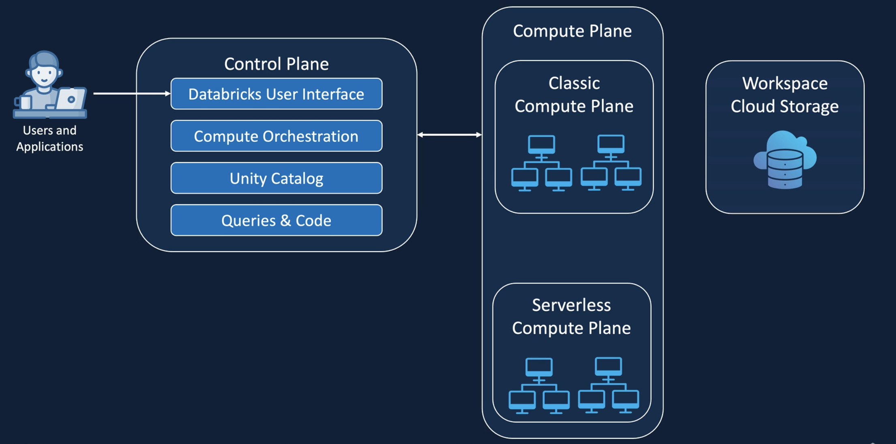
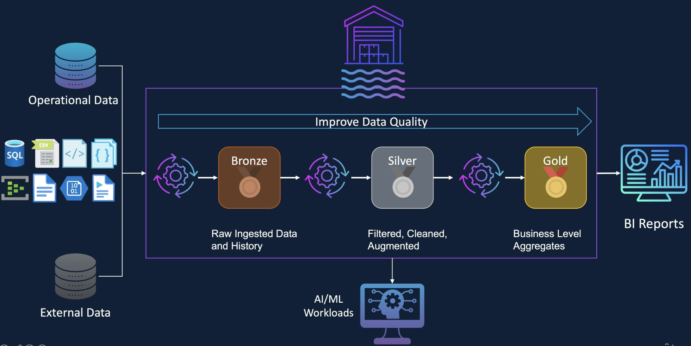

# Databricks Series(1): Foundation

As organizations increasingly rely on data for decision-making, AI, and competitive advantage, the need for
professionals who can build and maintain the foundational data infrastructure is skyrocketing. Databricks is the leading
platform which equips engineers with the skills to build, manage, and optimize modern data platforms, placing you at the
forefront of data engineering innovation and making you a highly valuable asset in any data-driven organization.

## Data Warhouse vs Data Lakehouse

Databricks introduced the "Data Lakehouse" concept into data engineering field. It articulated the architecture,
provided the key enabling technology (Delta Lake), and popularized the "Lakehouse" term to describe this new paradigm.
As a data engineer, we must know what it brings comparing the traditional Data Warehouse.

1. Relational database technology vs Data lake (object storage) + Delta Lake (or similar) layer
2. Primarily structured data vs Structured, semi-structured, and unstructured data (all types)
3. Schema-on-Write: Strict schema enforced at ingestion vs Schema-on-Read (for raw data), Schema-on-Write (for refined
   data): Flexible for raw data, enforced for curated data.
4. Business Intelligence (BI), traditional reporting, structured analytics vs varied workloads, from BI, AI/ML,
   streaming analytics, real-time analytics, data science, data sharing.
5. Can be expensive (compute and storage often coupled) vs Generally more cost-effective (separate compute and storage,
   cheaper object storage).
6. Can have significant vendor lock-in vs reduced vendor lock-in due to open formats and open-source components (Spark,
   Delta Lake).

## The Databircks Architecture

Although Databricks has its own platform, but most company are using Databricks through cloud providers, and Databricks
did a great job on integration with Cloud providers. Engineers can easily access databricks from Cloud console.

From functional perspective, the archiectur are construct with 3 layers: Control layer, Compute layer and Storage layer

From ownership perspective, The controla layer and serverless compute are blong to Databricks subscription, Classic
compute and Storage are belong to user's subscription. The on-prem resources can be accessed from both serverless or
classic compute.

## Medallion Architecture

- Data lineage & Tracibity
- Data Goverance & compliance
- Support incremental processing
- Enhance performance & scalability
- Data security

## Databricks Workspace Components

After we got the high level architecture around Databricks, Let's dive into the components used to do the work.

### Git Folders/Repos

Integrated git repos direct into Databricks workspace. Engineer can working same as vscode in the databricks workspace.

### Notebooks

After get git repo, the code are writing in notebooks, currently support SQL, python, scala and R. the note books
language can config at the whole level. at each cell, we can use magic command to switch language(%scala, %fs, %python,
%sh, %md, %pip) or use %run to import another notebook

Databricks also provide some utils like dbutils.fs, dbutils.secret, dbutils.widgets

### Cluster

When code is done, it will be run in the spark cluster(the compute resource). In Databrciks, there are 2 kinds of
cluster:

1. All Purpose Cluster: manually created, expensive, shared among users, good for interactive workload, persistent
2. Job Cluster:created by jobs,terminated at the end of job, cheaper, good for automation.

Cluster has a bunch of configuration:

1. Access Mode: Single, Shared, No Isolation Shared
2. Runtime: spark version,lib, supporting, photon
3. Auto termination
4. Auto Scaling
5. VM Type & Size: memory, cpu, Gpu
6. Policy: set restricts to user/Group

## Unity Catalog

In Databricks, Most of the operations executes through Unity Catalog, Unity Catalog is an abstraction layer on cloud
storage, which provides a single, unified point of access control, auditing, lineage, and data discovery across all data
assets (tables, views, and files/volumes) stored in a Databricks Lakehouse, regardless of the cloud platform (AWS,
Azure, GCP).

The main concepts under Unity Catalog:

- Storage Credential: the credential to connect to cloud storage.
- External Location: Create the reference to cloud storage, After it, the data can be used in Notelook directly.
- Catalog: Highest level of the three-level namespace (catalog.schema.table/volume) and serves as the primary
  organizational unit for data assets.
  - Schema: aka "database", It is the container for all the data and UDF.
    - Table: Storing raw, cleaned, aggregated, or transformed data; acting as the source of truth for various workloads
      (BI, ML, analytics).
      - Managed: Both data and metadata are managed by Databricks
      - External: only metadata is managed by databricks. the data is in other storage.
    - View: Store the SQL query definition, Simplifying complex queries, providing specific data subsets, enforcing
      row/column-level security, presenting pre-joined or aggregated data for ease of use.
    - Volume: managing raw files in cloud storage with Unity Catalog's governance, especially for data that isn't yet
      structured or doesn't need to be immediately tabular.
      - Managed: Both data and metadata are managed by Databricks
      - External: only metadata is managed by databricks. the data is in other storage.
    - Functions: User definded function for easy reuse.
- Service Credential: a long-term cloud credential (like an AWS IAM role ARN, an Azure Service Principal, or a GCP
  service account) that Unity Catalog can use to access data in your cloud object storage on your behalf.
- Connections: allows you to integrate and query external data systems (like other databases, data warehouses, or even
  other cloud data stores) without necessarily ingesting or moving all that data into your Databricks Lakehouse.
  - federated query
  - migrate data
  - cross platform analytics
- Share: a logical grouping of one or more tables and/or volumes that a provider intends to share with one or more
  recipients. It acts as the container for the data assets being shared.
- Provider: The organization or Databricks account that owns and manages the data being shared.
- Recipent: The organization, Databricks account, or user that consumes the data shared by a provider.

To be continue...
